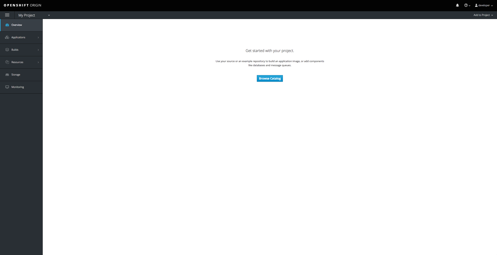
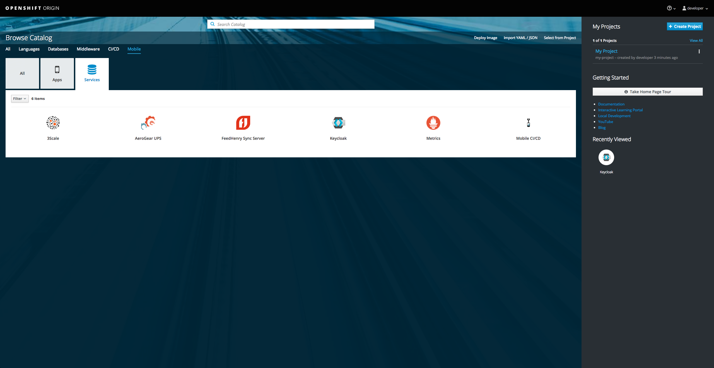
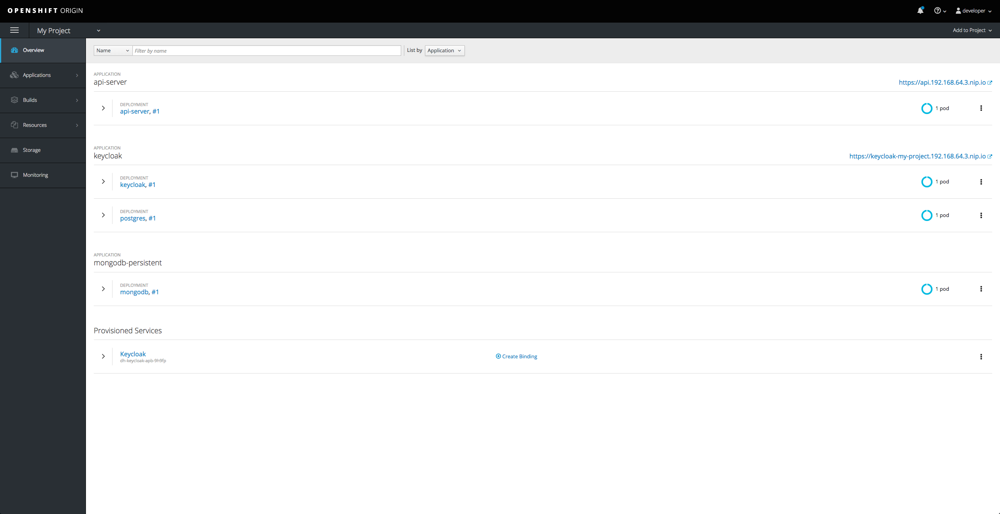

# Installion Guide for Backend Services

1. Install Minishift

    1.1 Download the latest release from [Minishift release page](https://github.com/minishift/minishift/releases). Please ensure choose the right package for the operation system.

    1.2 Follow the [Minishift installation instructions](https://docs.openshift.org/latest/minishift/getting-started/installing.html) to install minishift.

2. Install OpenShift CLI

    2.1 Follow this [instructions](https://docs.openshift.org/latest/cli_reference/get_started_cli.html#installing-the-cli) to install the Openshift Cli tool and enable it.

3. Install Mobile Core Addon

    3.1 Clone [minishift-mobile-addon repo](https://github.com/aerogear/minishift-mobilecore-addon) from Github.

    3.2 Follow the Readme file to install and enable the mobile addon.

4. Start Minishift with Mobile Core enabled

    You can run this command to start Minishift with mobile core addon enabled:

    ```
    minishift start --openshift-version 3.7.0 --service-catalog
    ```

    This command will take a few minutes to run and it will print out messages about its progress. Wait until the command finish running. You should see something similar to this near the end of the output:

    ```
    OpenShift server started.

    The server is accessible via web console at:
    https://192.168.64.3.nip.io:8443

    You are logged in as:
    User:     developer
    Password: <any value>

    To login as administrator:
    oc login -u system:admin
    ```

    You should login to the Minishift console using this information.

5. Provision a Keycloak service

    5.1 After login to the Minishift console, you should see something like this:

    

    5.2 Choose Keycloak from the mobile services catalog

    Click on the `Browse Catalog` button, and then choose the `Mobile` sub nav. Click on `Services`, you should see all the services that are available:

    

    5.3 Provision Keycloak

    Select the `Keycloak` service, and follow the instructions on the screen. You do not need to change anything. At the end, click on `Create` and navigate back to the project overview.

    5.4 Ensure Keycloak is running

    You should see a service called `Keycloak` is being provisioned. Wait until it is ready. You should see something similar to this:

    

6. Configure Keycloak

    6.1 Login to Keycloak

    Once Keycloak is running, you can click on the URL of Keycloak and login to the admin console using the username/password specified in the provision process (default value is admin/admin).

    6.2 Import the realm definition file

    After login, move the cursor to the top left corner and click on `Add Realm`. In the `Add Relam` view, click on `Select file` button and choose the [secure-app-realm.json file](../keycloak/secure-app-realm.json) in the `projects/keycloak` folder of this repo. Then click on `create` and it will create a new realm called `Secure-app`.

7. Create the API Backend Service

   7.1 Login using the OpenShift CLI

   We will use the OpenShift CLI to create the Backend API service. To do that, you first need to login using `oc` and use the right project:

   ```
   oc login https://192.168.64.3:8443 -u developer -p <password>
   oc project my-project
   ```

   Please make sure the right URL and user credential is being used.

   7.2 Create the backend service

   You need to use the `api-server.json` file in this folder and run the following command:

   ```
   oc process -f api-server.json -p API_SERVER_HOST=api.192.168.64.3.nip.io -p KEYCLOAK_URL=https://keycloak-myproject.192.168.64.3.nip.io | oc create -f -
   ```

   Please replace the hostname with the value that matches your own minishift instance.

   Go to Minishift web console and wait for the services to be ready. You should see something similar to this when everything is up and running:

   


Now the backend services are up and running. You can now configure and build the client applications.


